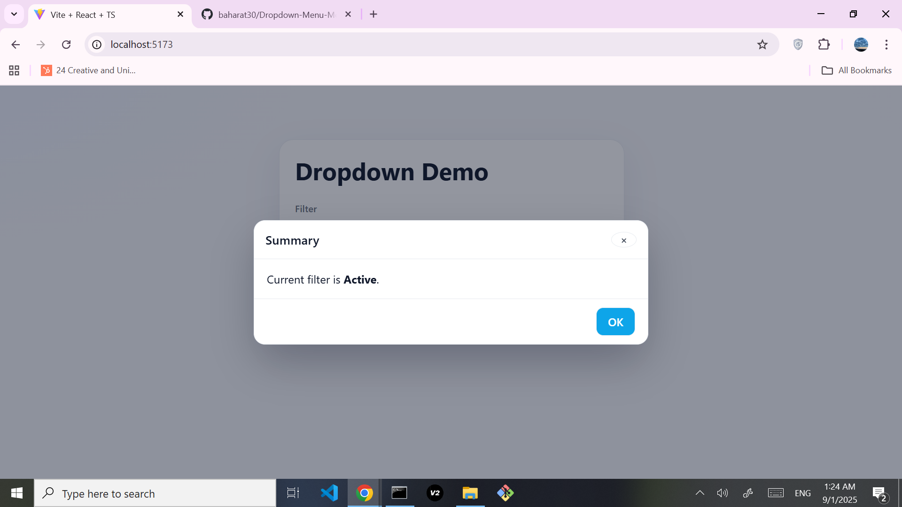

# Dropdown Demo (React + TypeScript + Vite)

A small demo showcasing a custom **Dropdown** and a simple **Modal** built with React + TypeScript + Vite.

> **Note:** This project is **not fully responsive** and is created **only to demonstrate my UI skills**, not as a production-ready app.

---

## 📸 Screenshots

<p align="center">
  
</p>

<p align="center">
  
</p>

---

## 🚀 Getting Started

```bash
# clone
git clone https://github.com/USERNAME/REPO.git
cd REPO

# install
npm install

# dev
npm run dev
# open http://localhost:5173
